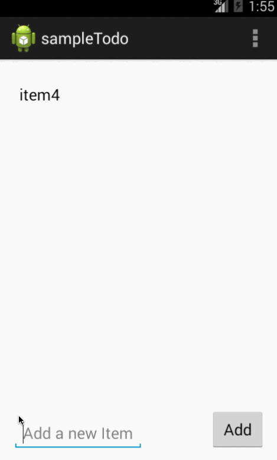

# ToDo Android App
This is the first Android App which can handle a list of todos.
   
Time Spent : 3 hours

Completed user stories.

  1. User can view the list of to do items.
  2. User can add a new item
  3. User can delete an item
  4. The items are stored in a file and persisted.

## Demo

